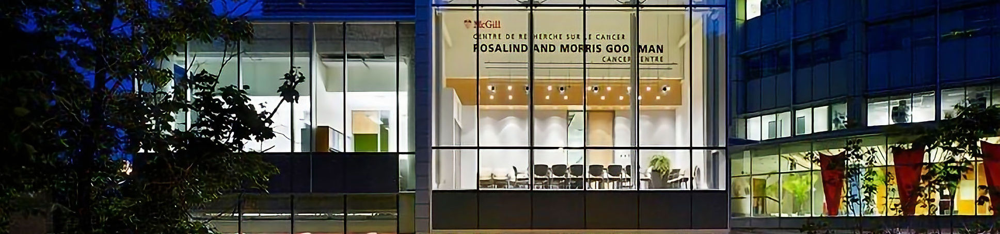

### Hi there 👋

## List of Public Repositories
* [Single-cell spatial landscapes of the lung tumor immune microenvironment](https://github.com/walsh-quail-labs/IMC-Lung)
* [Single-cell spatial immune landscapes of primary and metastatic brain tumors](https://github.com/walsh-quail-labs/IMC-Brain)

<!--## Maintainers of these repositories
* [Elham Karimi](https://github.com/ekarimi)
* [Morteza Rezanejad](https://github.com/mrezanejad)-->

**Contact information:** 
[Logan Walsh, PhD](https://www.lwalshlab.com/) 
Assistant Professor 
Rosalind & Morris Goodman Cancer 
Research Centre 
Department of Human Genetics 
McGill University 
1160 Pine Avenue West 
Montreal  
Quebec, Canada  
H3A 1A3 
Tel. office: 514-398-3052 
Tel. lab: 514-398-1400 
Email: logan.walsh@mcgill.ca 

<!--
**walsh-quail-labs/walsh-quail-labs** is a ✨ _special_ ✨ repository because its `README.md` (this file) appears on your GitHub profile.

Here are some ideas to get you started:

- 🔭 I’m currently working on ...
- 🌱 I’m currently learning ...
- 👯 I’m looking to collaborate on ...
- 🤔 I’m looking for help with ...
- 💬 Ask me about ...
- 📫 How to reach me: ...
- 😄 Pronouns: ...
- ⚡ Fun fact: ...
-->
